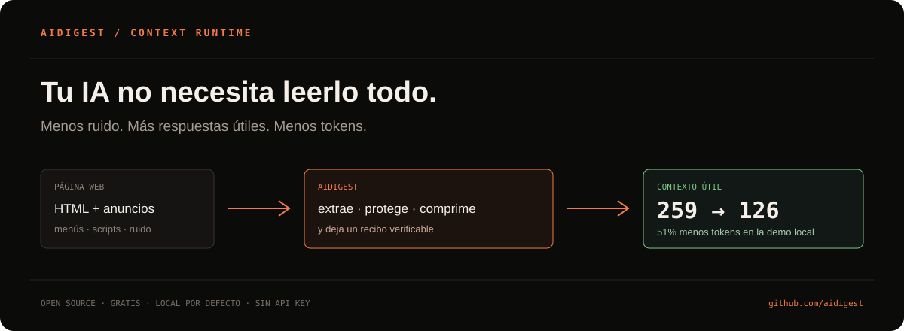
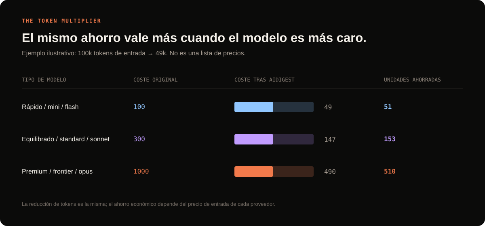

# aidigest

**The free layer that helps every AI read less and understand more.**

[Español](./README.md) · [English](./README.en.md)

> The internet contains useful information — and a lot of noise. aidigest keeps the useful part before it reaches your AI agent, shows the real saving, and helps protect its context.

## The idea in one sentence

Open aidigest, choose your agent, and keep working. It cleans web pages, removes repeated content, detects prompt-injection signals, and returns a shorter, traceable version. Less unnecessary reading means fewer tokens, less waiting, and lower cost.

## Start without learning anything new

1. Download [aidigest-panel.exe](https://github.com/iarttools/aidigest/releases/latest/download/aidigest-panel.exe).
2. Double-click it. You do not need Node.js, an API key, or another subscription.
3. Watch the local demo: **259 → 126 tokens**, a **51% reduction** in the included example.
4. Choose **Configure an agent**, select Claude Desktop, Cursor, OpenCode, or VS Code, and let aidigest prepare the connection.

You can also give this repository link to your coding assistant and ask it to install aidigest automatically. The Spanish README contains the full command reference; the application itself includes a Spanish/English switch.

To show aidigest to someone else, use the [30-second demo script](./docs/DEMO.md) and the [ready-to-post launch messages](./docs/LAUNCH.md).

## Who benefits

| If you are… | aidigest helps you… |
| --- | --- |
| Using ChatGPT, Claude, or another AI | receive cleaner pages without changing your workflow |
| Building software | spend less context on docs, repositories, and technical research |
| Working in a team | measure before/after tokens and share a real proof of savings |
| Careful about privacy | keep metrics and settings on your computer by default |

The reduction depends on each page. There is no magic number: the panel shows the real result of every read.

> The chart uses normalized cost units, not a live provider price list. The message is simple: the same token reduction has a bigger financial impact on more expensive input models.

## What it does

- extracts the main content from HTML, Markdown, text, JSON, and XML;
- removes navigation, ads, repeated sections, scripts, and boilerplate;
- detects known prompt-injection patterns before delivery;
- supports answer, research, coding, compare, vision, and full tasks;
- enforces token budgets and can keep reversible context blocks;
- tracks tokens before/after, estimated savings, quality, cache hits, redactions, and safety signals;
- supports Claude Desktop, Cursor, OpenCode, and VS Code with selectable, reversible setup;
- includes a portable black desktop panel, tray controls, CPU fallback, and optional WebGPU probing.

## Privacy and trust

aidigest is local-first. Stats, preferences, and agent configuration stay on the machine unless you choose to share them. HTTPS connections are tunneled without MITM decryption. Automatic mode can be switched back to manual, and configuration files are backed up before aidigest edits them.

No detector can make every web page safe. Treat external content as untrusted, review sensitive workflows, and use the manual mode when you need explicit control.

## From GitHub

The project is free and open source because the goal is simple: help more people spend less context and money on AI. Contributions, tests, translations, examples, bug reports, and stars are welcome.

For the full technical guide, CLI reference, MCP setup, benchmarks, GPU notes, troubleshooting, and the automatic installer, see the [Spanish README](./README.md).

## License

MIT. See [LICENSE](./LICENSE).

