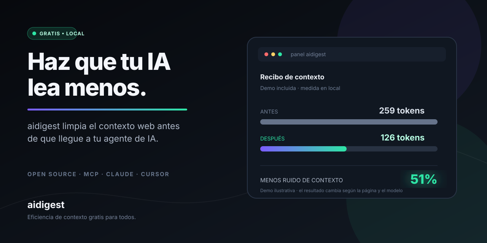

# aidigest

**La capa gratuita que hace que cualquier IA lea menos y entienda mejor.**

> **Idioma / Language:** 🇪🇸 **Español** · [🇬🇧 English](./README.md)

> Internet está lleno de información útil… y de mucho ruido. aidigest se queda con lo importante antes de que llegue a tu agente, te enseña cuánto has ahorrado y ayuda a proteger el contexto.

## En una frase

Abres aidigest, eliges tu agente y sigues trabajando. La herramienta limpia páginas web, quita contenido repetido, detecta señales de prompt injection y entrega una versión breve y trazable. Menos lectura innecesaria significa menos tokens, menos espera y menor coste.

## Empieza sin aprender nada nuevo

1. Descarga [aidigest-panel.exe](https://github.com/iarttools/aidigest/releases/latest/download/aidigest-panel.exe).
2. Haz doble clic: no necesitas Node.js, una API key ni otra suscripción.
3. Mira la demostración local: **259 → 126 tokens**, un **51 % menos** en el ejemplo incluido.
4. Pulsa **Configurar un agente**, selecciona Claude Desktop, Cursor, OpenCode o VS Code y deja que aidigest prepare la conexión.

También puedes pedirle a tu propia IA que lo instale desde la URL del repositorio. La guía completa está en [Instalación automática dirigida por una IA](#instalación-automática-dirigida-por-una-ia).

Para enseñar aidigest a otra persona, usa el [guion de demo de 30 segundos](./docs/DEMO.md) y los [mensajes preparados para publicar](./docs/LAUNCH.md).

## Qué gana cada persona

| Si eres… | aidigest te ayuda a… |
| --- | --- |
| Usuario de ChatGPT, Claude u otra IA | recibir páginas más limpias sin cambiar tu forma de trabajar |
| Desarrollador | ahorrar contexto en documentación, repositorios y búsquedas técnicas |
| Equipo | medir tokens antes/después y compartir una prueba real del ahorro |
| Persona preocupada por la privacidad | mantener métricas y configuración en tu ordenador por defecto |

La reducción cambia según la página. No hay una cifra mágica: el panel enseña el resultado real de cada lectura.

> La gráfica compara unidades normalizadas, no tarifas actuales de proveedores. La idea es sencilla: el mismo porcentaje de tokens ahorrados tiene un impacto económico mayor en modelos de entrada más caros.

## Ayúdanos a que lo use más gente

Si aidigest te ahorra tiempo o tokens, la mejor ayuda es compartir una captura con el resultado de una página real, dejar una estrella en GitHub o aportar una traducción, un agente compatible o un caso de prueba. Hemos preparado mensajes listos para publicar en [`docs/LAUNCH.md`](./docs/LAUNCH.md).

## Por qué existe

Cuando un agente lee una página, normalmente recibe mucho más que el artículo o la documentación importante:

- menús, cabeceras y pies de página;
- anuncios, banners, cookies y avisos legales;
- scripts, HTML repetido y contenido invisible;
- navegación secundaria y enlaces irrelevantes;
- texto duplicado entre páginas;
- instrucciones maliciosas ocultas para manipular al agente;
- credenciales, emails u otros datos sensibles que no deberían viajar al modelo.

Ese contenido también consume tokens. aidigest intenta eliminarlo antes de que llegue al agente.

La reducción no es una promesa fija: depende de cada página. En las pruebas incluidas en este repositorio:

| Caso | Reducción observada |
| --- | ---: |
| Página pequeña | 62 % |
| Página mediana | 46 % |
| Página grande | 35 % |

La herramienta siempre muestra el resultado real de cada lectura mediante un recibo de tokens antes/después.

## Qué hace exactamente

aidigest combina varias capas independientes:

1. **Obtención segura**: limita el tamaño de respuesta y el tiempo de espera.
2. **Normalización**: admite HTML, Markdown, texto plano, JSON y XML legible.
3. **Extracción**: usa Readability para separar el contenido principal del ruido web.
4. **Limpieza**: elimina boilerplate, espacios innecesarios y duplicados básicos.
5. **Protección contra prompt injection**: detecta patrones que intentan cambiar las instrucciones del agente.
6. **Adaptación por tarea**: modos answer, research, coding, compare, vision y full.
7. **Compresión controlada**: presupuesto máximo de tokens, modo agresivo y contratos de salida.
8. **Trazabilidad**: fuentes, secciones, enlaces y estadísticas de calidad.
9. **Evidencias**: mapa de afirmaciones y posibles contradicciones numéricas.
10. **Contexto reversible**: bloques identificados que pueden recuperarse o ampliarse después.
11. **Redacción local**: emails, teléfonos, claves, JWTs y números de tarjeta con la opción redact.
12. **Cachés**: caché semántica y validación HTTP mediante ETag/Last-Modified.
13. **Métricas**: ledger local, ahorro estimado, calidad, inyecciones, redacciones y cache hits.

## Instalación rápida en Windows: un único EXE

Descarga o copia este archivo:

[Descargar aidigest-panel.exe desde GitHub Releases](https://github.com/iarttools/aidigest/releases/latest/download/aidigest-panel.exe)

Haz doble clic. No necesitas instalar Node.js ni ejecutar comandos.

El panel incluye:

- interfaz de escritorio negra;
- gráficos de tokens antes/después en tiempo real;
- ahorro estimado en dólares;
- calidad media y cache hits;
- actividad reciente;
- inyecciones detectadas;
- redacciones realizadas;
- botón ON/OFF para el proxy local;
- detección de WebGPU y prueba compute opcional;
- fallback automático a CPU.
- interfaz bilingüe español/English con selector persistente;
- estética de workspace técnico: terminal, runtime y estado del agente en una sola vista.

Al abrirlo por primera vez aparece una prueba local de 30 segundos: el panel ejecuta una página de ejemplo con el extractor real, muestra tokens antes/después y enseña las inyecciones retiradas. Después puedes abrir **Configurar un agente**: aidigest detecta automáticamente Claude Desktop, Cursor, OpenCode y VS Code por su aplicación instalada o por sus ficheros locales de configuración. Puedes seleccionar uno o varios y pulsar **Instalar aidigest en seleccionados**; si existe un fichero compatible, se crea una copia `.aidigest-backup` antes de modificarlo. La instalación conecta aidigest con esos agentes, no instala ni descarga los agentes de terceros.

El panel también incluye un **Centro de confianza**, una tarjeta de ahorro compartible en JSON y un icono de bandeja del sistema para abrirlo, cambiar AUTO/MANUAL, iniciar/detener el proxy o salir sin dejar la ventana abierta.

El proxy integrado escucha en:

~~~text
http://127.0.0.1:8080
~~~

Una petición de ejemplo sería:

~~~text
http://127.0.0.1:8080/?url=https%3A%2F%2Fexample.com%2Farticle
~~~

El ejecutable es portable: puedes moverlo a otra carpeta y volver a abrirlo.

## Instalación automática dirigida por una IA

Esta es la experiencia recomendada para usuarios que quieren que aidigest funcione en todas sus lecturas web sin aprender los comandos.

Solo tienes que darle a tu agente de programación o asistente con terminal la URL del repositorio de GitHub y pedirle:

~~~text
Instala aidigest desde este repositorio en modo automático y deja el proxy preparado para todas mis lecturas web:
<URL_DEL_REPOSITORIO>
~~~

La IA puede ejecutar el flujo completo:

~~~bash
git clone <URL_DEL_REPOSITORIO> aidigest
cd aidigest
npm run setup:ai -- --repo <URL_DEL_REPOSITORIO> --mode automatic --yes
~~~

Si la IA lanza `setup:ai` desde otra carpeta, el instalador crea automáticamente una carpeta `aidigest` en el directorio actual y clona allí el repositorio; `--dir <carpeta>` permite elegir otra ubicación.

El instalador reconocido por el proyecto hace lo siguiente:

1. comprueba que el origen es un repositorio HTTPS de GitHub;
2. instala las dependencias fijadas en package-lock.json;
3. compila la CLI;
4. crea la configuración persistente en .aidigest/config.json;
5. arranca el proxy local en segundo plano;
6. registra el arranque automático en Windows;
7. prepara HTTP_PROXY, HTTPS_PROXY, AIDIGEST_PROXY_URL y NODE_OPTIONS para nuevos procesos;
8. activa el hook de Node para que fetch y undici pasen por aidigest;
9. deja disponible el cambio entre automático y manual.

La opción `--yes` es una confirmación explícita: instalar dependencias y modificar el entorno de red son acciones que la IA debe enseñar al usuario antes de ejecutarlas. Una IA puede realizar el proceso completo, pero no debe ejecutar código de un repositorio desconocido sin aprobación.

En Windows, las variables y el arranque automático quedan persistidos para nuevas sesiones. En macOS y Linux, el proxy local y el fichero de configuración funcionan igualmente, pero la persistencia del entorno depende del shell o del gestor de servicios que uses; puedes exportar `HTTP_PROXY`, `HTTPS_PROXY` y `AIDIGEST_PROXY_URL`, o pasar explícitamente la URL del proxy al agente.

Si ya estás dentro del repositorio, también puedes ejecutar directamente:

~~~bash
node dist/cli.js setup --mode automatic --repo <URL_DEL_REPOSITORIO> --yes
~~~

### Qué significa “todas las webs”

En modo automático, los agentes y procesos que respetan HTTP_PROXY/HTTPS_PROXY o que usan el hook de Node reciben el tráfico a través del proxy sin tener que añadir `--sources`, `--redact` ni `--task` en cada URL. El proxy procesa HTML y mantiene binarios intactos; HTTPS se tuneliza sin MITM.

Las aplicaciones que ignoran las variables de proxy o usan un cliente completamente cerrado no pueden ser interceptadas desde fuera. En esos casos se usa MCP, el endpoint local explícito o la configuración de proxy propia de la aplicación.

### Cambiar a modo manual

El modo automático nunca es irreversible. Puedes desactivarlo desde cualquier terminal:

~~~bash
node dist/cli.js mode manual
~~~

Esto detiene el servicio gestionado, desactiva la interceptación del hook y deja al usuario con el control por comandos:

~~~bash
node dist/cli.js https://example.com/article --sources --redact
node dist/cli.js proxy --port 8080
~~~

Para volver a activar la automatización:

~~~bash
node dist/cli.js mode automatic
~~~

También puedes cambiarlo en el panel con **Modo del agente → Activar automático / Pasar a manual**.

Si no quieres que el instalador persista variables de proxy para nuevos procesos:

~~~bash
npm run setup:ai -- --repo <URL_DEL_REPOSITORIO> --mode automatic --yes --no-system-proxy
~~~

## Instalación desde GitHub y desde el código fuente

### Requisitos

- Windows, macOS o Linux para la CLI y el servidor;
- Node.js 18 o superior;
- npm;
- Git, si vas a clonar el repositorio.

Comprueba tu versión:

~~~bash
node --version
npm --version
~~~

### Clonar e instalar

Desde GitHub:

~~~bash
git clone <URL_DEL_REPOSITORIO>
cd aidigest
npm ci
npm run build
~~~

npm ci instala exactamente las versiones guardadas en package-lock.json.

### Ejecutar la CLI desde el proyecto

~~~bash
node dist/cli.js https://example.com/article
~~~

Durante el desarrollo también puedes usar:

~~~bash
npm run dev -- https://example.com/article
~~~

### Construir el ejecutable de escritorio

En Windows:

~~~bash
npm run dist:electron
~~~

El resultado queda en:

~~~text
dist-electron/aidigest-panel.exe
~~~

El empaquetado es portable y contiene el panel, el proxy integrado y todos los recursos necesarios.

## Uso básico de la CLI

Después de npm run build, la forma general es:

~~~bash
node dist/cli.js <URL> [opciones]
~~~

Ejemplos:

~~~bash
# Digest normal
node dist/cli.js https://example.com/article

# Salida JSON para automatizaciones
node dist/cli.js https://example.com/article --json

# Limitar el contexto a 4.000 tokens
node dist/cli.js https://example.com/article --budget 4000

# Responder una pregunta usando solo los bloques relevantes
node dist/cli.js https://example.com/article --question "¿Cuál es el precio?"

# Añadir fuentes y trazabilidad
node dist/cli.js https://example.com/article --sources

# Redactar datos sensibles antes de devolver el contexto
node dist/cli.js https://example.com/article --redact

# Preservar bloques recuperables
node dist/cli.js https://example.com/article --reversible

# Expandir bloques concretos de un contexto reversible
node dist/cli.js https://example.com/article --expand c2,c4

# Usar una estrategia adaptada a código
node dist/cli.js https://example.com/docs --task coding --sources

# Pedir una salida con presupuesto garantizado
node dist/cli.js https://example.com/article --contract --budget 500

# Reutilizar páginas casi idénticas
node dist/cli.js https://example.com/article --semcache

# Validar cambios del servidor con ETag o Last-Modified
node dist/cli.js https://example.com/article --http-cache

# Instalar y activar automatización para una IA
node dist/cli.js setup --mode automatic --repo <github-url> --yes

# Consultar o cambiar el modo global
node dist/cli.js mode
node dist/cli.js mode manual
node dist/cli.js mode automatic
~~~

### Opciones principales

| Opción | Función |
| --- | --- |
| --json | Devuelve todos los metadatos para programas y agentes. |
| --budget <tokens> | Limita el tamaño máximo de salida. |
| --contract | Garantiza que la salida respete el presupuesto mediante extracción controlada. |
| --task <modo> | Cambia la estrategia según la tarea. |
| --sources | Añade manifiesto de fuentes y citas. |
| --redact | Redacta datos sensibles localmente. |
| --question <texto> | Recupera solo los bloques más relacionados con una pregunta. |
| --reversible | Añade identificadores c1, c2, etc. a los bloques de contexto. |
| --expand <ids> | Expande bloques concretos. |
| --delta | Devuelve solo los cambios desde el último digest. |
| --schema <archivo> | Extrae únicamente los campos definidos en un esquema JSON. |
| --tier <tier> | Elige nivel de compresión y estructura. |
| --aggressive | Aplica compresión adicional para extracción pura. |
| --stream | Emite el resultado por bloques. |
| --no-scrub | Desactiva la protección contra inyecciones. Solo para pruebas controladas. |

## Uso con Claude y otros agentes

Hay tres formas de integrarlo.

### Opción A: MCP, integración nativa

MCP permite que Claude Desktop, Cursor, Copilot u otro cliente compatible descubra aidigest como una herramienta.

Después de instalar y compilar:

~~~bash
npm run build
~~~

Configura el cliente MCP con una ruta absoluta al servidor:

~~~json
{
  "mcpServers": {
    "aidigest": {
      "command": "node",
      "args": ["C:\\ruta\\completa\\aidigest\\dist\\mcp.js"]
    }
  }
}
~~~

El servidor expone aidigest_digest con parámetros como:

~~~json
{
  "url": "https://example.com/article",
  "task": "research",
  "budget": 3000,
  "sources": true,
  "redact": true,
  "question": "¿Qué conclusiones presenta el artículo?"
}
~~~

La respuesta incluye el digest, recibo de ahorro, calidad, procedencia, evidencias y bloques de contexto.

El servidor también expone `aidigest_mode`. Un agente puede activar o desactivar el modo compartido:

~~~json
{
  "mode": "automatic",
  "port": 8080,
  "repo": "https://github.com/tu-usuario/aidigest"
}
~~~

En automático, el agente debe preferir aidigest para sus lecturas web. En manual, `aidigest_mode` deja la herramienta disponible pero no intercepta tráfico: el usuario decide cuándo llamar a `aidigest_digest`.

Prueba el servidor localmente:

~~~bash
npm run smoke:mcp
~~~

### Opción B: proxy, sin cambiar el agente

El proxy permite que un agente que ya sabe hacer peticiones HTTP reciba el digest sin integrar un SDK.

~~~bash
node dist/cli.js proxy --port 8080 --task research --sources --redact
~~~

Después apunta la petición del agente a:

~~~text
http://127.0.0.1:8080/?url=<URL_CODIFICADA>
~~~

Las respuestas HTML se transforman. Las respuestas no HTML, incluidos archivos binarios, pasan sin convertir y de forma segura.

El proxy también expone cabeceras de observabilidad:

~~~text
x-aidigest-before
x-aidigest-after
x-aidigest-saved
x-aidigest-quality
x-aidigest-injections
x-aidigest-redactions
x-aidigest-cache
~~~

El modo proxy no descifra HTTPS mediante MITM. Las conexiones CONNECT se mantienen como túnel; solo se procesa el flujo HTTP que aidigest puede leer de forma explícita.

### Opción C: panel EXE

Abre aidigest-panel.exe, activa **Puente del agente** y utiliza el endpoint local:

~~~text
http://127.0.0.1:8080/?url=<URL_CODIFICADA>
~~~

El panel actualiza el ledger cada segundo y muestra lo que está ocurriendo sin abrir una web adicional.

La interfaz puede cambiarse entre **ES** y **EN** desde la barra superior o la barra lateral. La elección se guarda localmente para que el panel conserve el idioma al volver a abrirlo; no se envía ninguna preferencia a Internet.

La tarjeta **Modo del agente** controla la política global:

- **AUTO**: el proxy y el hook configurados por aidigest se consideran activos por defecto;
- **MANUAL**: se detiene el servicio gestionado por aidigest y el usuario usa la CLI o MCP de forma explícita.

El botón no borra el historial ni desinstala el proyecto. Solo cambia la política de interceptación y puede pulsarse de nuevo para recuperar el modo automático.

## Simular ahorro de Claude y otros modelos

El laboratorio de ahorro no realiza cargos ni necesita una API. Es una estimación basada en tokens de entrada y precios configurados.

~~~bash
node dist/cli.js savings \
  --raw-tokens 2017 \
  --distilled-tokens 1088 \
  --pages-per-day 100 \
  --days 30 \
  --model claude-sonnet-4-6
~~~

Ejemplo de salida:

~~~text
Pages simulated: 3000
Input tokens: 6.051.000 -> 3.264.000
Tokens saved: 2.787.000 (46%)
Raw input cost: $18.153
Digest input cost: $9.792
Estimated saving: $8.361
~~~

La estimación depende del modelo, del volumen, de la proporción de páginas repetidas, del cacheo y del precio real que aplique tu proveedor. No debe confundirse con una factura.

Para consultar el ledger local:

~~~bash
node dist/cli.js stats --model claude-sonnet-4-6
~~~

Por defecto se guarda en:

~~~text
<carpeta-de-usuario>/.aidigest/stats.json
~~~

El panel lee el mismo archivo, por lo que la CLI, el MCP y el proxy alimentan las mismas gráficas.

## GPU y WebGPU

La aplicación detecta si Chromium puede usar WebGPU y ejecuta una pequeña operación compute local para verificar el adaptador.

Puedes consultar el entorno de ejecución de la CLI con:

~~~bash
node dist/cli.js acceleration --json
~~~

Hay dos resultados válidos:

- WEBGPU: existe adaptador y la prueba compute funciona;
- CPU: WebGPU no está disponible o el dispositivo rechaza la prueba.

El fallback CPU es intencionado. La extracción HTML, Readability, expresiones regulares y validaciones necesitan más de la CPU que de una GPU. aidigest no hace depender la corrección de un driver gráfico. La GPU se usa como aceleración opcional del entorno gráfico y como base para futuras operaciones vectoriales, manteniendo el procesamiento principal estable para todos.

## Seguridad y privacidad

### Protecciones incluidas

- límite de 10 MB por respuesta;
- timeout de red;
- solo URLs HTTP/HTTPS;
- filtrado de prompt injection;
- redacción opcional de secretos y PII;
- proxy limitado a 127.0.0.1;
- ledger local con escritura atómica;
- escape de contenido antes de insertarlo en el panel;
- respuestas binarias preservadas sin convertirlas a texto;
- CSP y aislamiento de contexto en Electron;
- sin telemetría remota incorporada por defecto.

### Limitaciones importantes

Ningún detector heurístico garantiza que una página sea segura. El scrubber reduce patrones conocidos, pero el agente y el usuario deben seguir tratando el contenido externo como no confiable.

La redacción local también es heurística. Antes de usar aidigest en un entorno regulado, valida las reglas con tus propios datos y añade un sistema DLP específico si lo necesitas.

## Arquitectura técnica

~~~text
src/cli.ts                 CLI y comandos operativos
src/mcp.ts                 servidor MCP por stdio
src/app-proxy.ts           proxy embebido para el panel
src/dashboard.ts           snapshot del ledger y dashboard
src/core/extract.ts        extracción principal con Readability
src/core/scrub.ts          detección de prompt injection
src/core/budget.ts         ajuste de salida al presupuesto
src/core/contract.ts       contrato de tamaño garantizado
src/core/tasks.ts          perfiles answer/research/coding/compare/vision/full
src/core/provenance.ts     fuentes, citas y estructura
src/core/quality.ts        puntuación de cobertura y trazabilidad
src/core/evidence.ts       mapa de evidencias y contradicciones
src/core/context.ts        bloques reversibles y recuperación por consulta
src/core/redact.ts         redacción de secretos y datos sensibles
src/core/httpcache.ts      caché condicional segura
src/core/proxy.ts          proxy HTTP con protección de binarios y límites
src/core/stats.ts          ledger, costes y métricas
src/core/acceleration.ts   detección WebGPU y fallback CPU
electron/                  panel de escritorio y preload aislado
scripts/benchmark.mjs      benchmark de extracción, proxy y módulos
~~~

Pipeline principal:

~~~text
fetch
  → validar protocolo, tamaño y timeout
  → normalizar HTML/Markdown/texto/JSON/XML
  → extraer contenido principal
  → limpiar boilerplate
  → eliminar prompt injection
  → adaptar al tipo de tarea
  → crear fuentes, calidad y evidencias
  → recuperar contexto o hacerlo reversible
  → redactar datos sensibles
  → ajustar presupuesto, schema, delta o caché
  → registrar ahorro y entregar salida
~~~

## Comandos adicionales

~~~bash
# Puntuación de preparación de una web para agentes
node dist/cli.js score https://example.com

# Generar llms.txt
node dist/cli.js llms https://example.com -o llms.txt

# Comparar dos documentos
node dist/cli.js diff before.md after.md

# Detectar duplicados en un JSON
node dist/cli.js dedup items.json

# Crear y leer paquetes offline
node dist/cli.js pack build docs <URL_1> <URL_2>
node dist/cli.js pack read docs.aidigest.json

# Consultar recomendación de modelo
node dist/cli.js route https://example.com

# Analizar spam o poisoning
node dist/cli.js spam https://example.com

# RAG sencillo sobre una única página
node dist/cli.js ask https://example.com "¿Qué requisitos aparecen?"

# Digest multimodal con imágenes, tablas y captions
node dist/cli.js multimodal https://example.com

# Dashboard web y servicio automático
node dist/cli.js dashboard 8090
node dist/cli.js serve --port 8080 --dash 8090
~~~

## Pruebas y rendimiento

Instala dependencias, compila y ejecuta la suite:

~~~bash
npm ci
npm run build
npm test
~~~

Estado verificado del proyecto:

~~~text
34 archivos de test
72 tests superados
0 tests fallidos
0 vulnerabilidades de producción en npm audit
~~~

Benchmark reproducible:

~~~bash
npm run benchmark
~~~

Resultados de referencia en Windows x64 con Node 24:

| Operación | Resultado de referencia |
| --- | ---: |
| Extracción pequeña | ~0,6 ms de media |
| Extracción mediana | ~1,8 ms de media |
| Extracción grande | ~7,4 ms de media |
| Scrubber | ~0,04 ms de media |
| Recuperación de contexto | ~0,09 ms de media |
| Grafo de evidencias | ~2,5 ms de media |
| Proxy | 69–134 solicitudes/s según concurrencia |
| Entradas malformadas | 0 errores no controlados |

Los números dependen del hardware y del contenido. El benchmark sirve para comparar cambios, no como garantía universal de latencia.

## Resolución de problemas

### El ejecutable no abre

En Windows, SmartScreen puede mostrar una advertencia porque el binario portable no está firmado comercialmente. Descárgalo únicamente desde una fuente de confianza, comprueba que el archivo es el esperado y permite la ejecución desde **Más información → Ejecutar de todas formas** si confías en la copia.

Si estás usando el código fuente, prueba la CLI para separar un problema del panel de un problema del proyecto:

~~~bash
npm ci
npm run build
node dist/cli.js https://example.com
~~~

### El proxy no responde

El panel usa el puerto 8080. Si otra aplicación lo está utilizando, cierra esa aplicación o usa la CLI con otro puerto:

~~~bash
node dist/cli.js proxy --port 8181
~~~

Después cambia la URL del agente a:

~~~text
http://127.0.0.1:8181/?url=<URL_CODIFICADA>
~~~

### Claude no encuentra la herramienta MCP

Comprueba tres cosas:

1. La ruta de dist/mcp.js es absoluta.
2. Has ejecutado npm run build después de clonar el repositorio.
3. Has reiniciado el cliente MCP después de modificar su configuración.

Para probarlo sin Claude Desktop:

~~~bash
npm run smoke:mcp
~~~

### Quiero dejar de interceptar páginas temporalmente

No hace falta desinstalar nada. Cambia a manual:

~~~bash
node dist/cli.js mode manual
~~~

Para restaurar la automatización:

~~~bash
node dist/cli.js mode automatic
~~~

El panel ofrece los mismos botones y el agente MCP puede cambiarlo con `aidigest_mode`.

### El panel muestra CPU en vez de WebGPU

Es un resultado válido. Significa que Chromium no ha expuesto un adaptador WebGPU compatible o que el driver ha rechazado la prueba. El digest continúa funcionando con CPU y no pierde funciones.

### Una página no se transforma como esperaba

No todas las páginas contienen contenido legible en HTML. Comprueba el tipo de respuesta, prueba con sources y usa JSON para inspeccionar todos los metadatos:

~~~bash
node dist/cli.js https://example.com/page --sources --json
~~~

Las respuestas binarias no se transforman: se mantienen intactas por diseño.

## Desarrollo y contribuciones

aidigest es gratuito porque el objetivo es que más agentes gasten menos tokens. Las mejoras que reduzcan coste, latencia o riesgo son bienvenidas.

Flujo recomendado:

~~~bash
npm ci
npm run build
npm test
npm run benchmark
npm run smoke:mcp
~~~

Antes de abrir un pull request:

- añade tests para el comportamiento nuevo;
- no incluyas claves ni datos privados;
- conserva el fallback CPU;
- no desactives límites de tamaño o timeout sin justificarlo;
- documenta cualquier cambio de formato o compatibilidad;
- comprueba que el panel sigue funcionando sin red.

## Filosofía del proyecto

aidigest no pretende sustituir a Claude ni competir con los modelos. Pretende hacer que todos ellos trabajen mejor.

La idea es abierta y simple:

> Si una IA va a leer Internet, primero debería recibir una versión limpia, medible y segura de Internet.

## Licencia

MIT. Puedes usarlo, modificarlo, integrarlo en tus herramientas y contribuir al proyecto.

Consulta [LICENSE](./LICENSE) para el texto completo.

