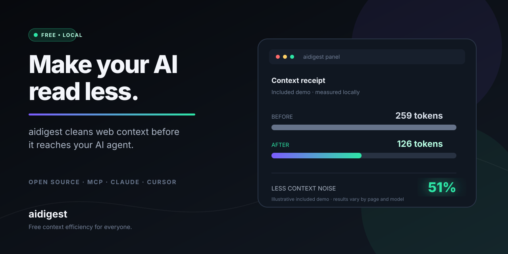
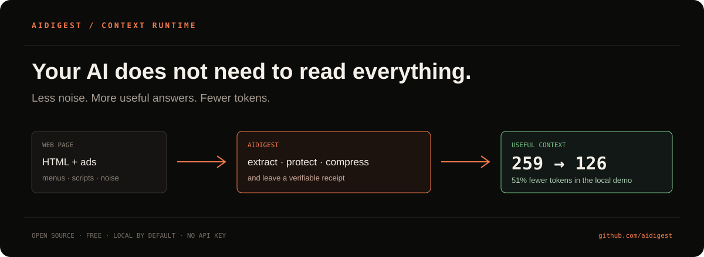
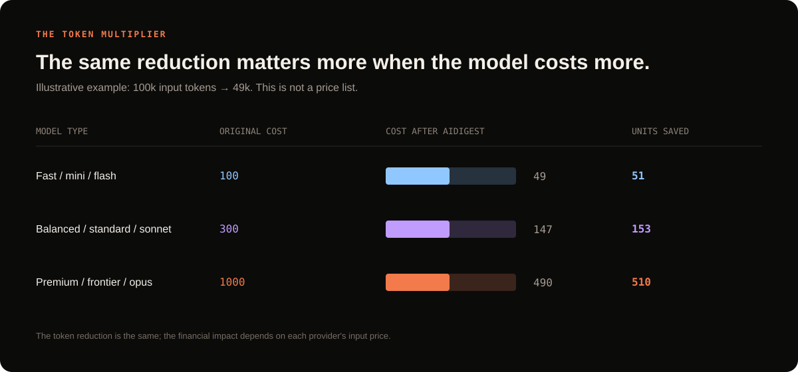

# aidigest

**The free layer that helps any AI read less and understand more.**

> **Language / Idioma:** 🇬🇧 **English** · [🇪🇸 Español](./README.en.md)

> The internet contains useful information — and a lot of noise. aidigest keeps the useful part before it reaches your agent, shows how much you saved, and helps protect its context.

## See aidigest in action

The animated preview plays directly in GitHub. Click it to open the full MP4. It shows the flow from noisy web content to a cleaner, measurable digest: **259 → 126 tokens** in the included example.

[Download the MP4 demo](https://raw.githubusercontent.com/iarttools/aidigest/main/docs/video/aidigest-youtube-demo.mp4)

## The idea in one sentence

Open aidigest, choose your agent, and keep working. It cleans web pages, removes repeated content, detects prompt-injection signals, and returns a shorter, traceable version. Less unnecessary reading means fewer tokens, less waiting, and lower cost.

## Start without learning anything new

1. Download [aidigest-panel.exe](https://github.com/iarttools/aidigest/releases/latest/download/aidigest-panel.exe).
2. Double-click it. You do not need Node.js, an API key, or another subscription.
3. Watch the local demo: **259 → 126 tokens**, a **51% reduction** in the included example.
4. Select **Configure an agent**, choose Claude Desktop, Cursor, OpenCode, or VS Code, and let aidigest prepare the connection.

You can also give this repository URL to your own coding assistant and ask it to install aidigest automatically. The full guide is in [AI-guided automatic installation](#ai-guided-automatic-installation).

To show aidigest to someone else, use the [30-second demo script](./docs/DEMO.md) and the [ready-to-post launch messages](./docs/LAUNCH.md).

## What each person gets

| If you are… | aidigest helps you… |
| --- | --- |
| Using ChatGPT, Claude, or another AI | receive cleaner pages without changing your workflow |
| Building software | spend less context on documentation, repositories, and technical research |
| Working in a team | measure before/after tokens and share real proof of the saving |
| Careful about privacy | keep metrics and configuration on your computer by default |

The reduction changes with every page. There is no magic number: the panel shows the real result for every read.

> The chart compares normalized cost units, not current provider prices. The idea is simple: the same percentage of saved tokens has a larger financial impact on more expensive input models.

## Help us reach more people

If aidigest saves you time or tokens, the most useful help is sharing a screenshot from a real page, starring the GitHub repository, or contributing a translation, agent integration, or test case. We have prepared copy in [`docs/LAUNCH.md`](./docs/LAUNCH.md).

## Why it exists

When an agent reads a page, it often receives much more than the article or documentation that matters:

- menus, headers, and footers;
- ads, banners, cookie notices, and legal text;
- scripts, repeated HTML, and hidden content;
- secondary navigation and irrelevant links;
- duplicated text across pages;
- malicious instructions hidden inside the page to manipulate the agent;
- credentials, email addresses, or other sensitive data that should not reach the model.

That content also consumes tokens. aidigest tries to remove it before it reaches the agent.

The reduction is not a fixed promise: it depends on the page. In the tests included in this repository:

| Case | Observed reduction |
| --- | ---: |
| Small page | 62% |
| Medium page | 46% |
| Large page | 35% |

The tool always shows the real result for each read through a before/after token receipt.

## What it actually does

aidigest combines several independent layers:

1. **Safe fetching**: limits response size and timeout.
2. **Normalization**: accepts readable HTML, Markdown, plain text, JSON, and XML.
3. **Extraction**: uses Readability to separate the main content from web noise.
4. **Cleaning**: removes boilerplate, unnecessary whitespace, and basic duplicates.
5. **Prompt-injection protection**: detects patterns that try to change the agent's instructions.
6. **Task adaptation**: answer, research, coding, compare, vision, and full modes.
7. **Controlled compression**: maximum token budgets, aggressive mode, and output contracts.
8. **Traceability**: sources, sections, links, and quality statistics.
9. **Evidence**: a map of claims and possible numerical contradictions.
10. **Reversible context**: identified blocks that can be recovered or expanded later.
11. **Local redaction**: emails, phone numbers, keys, JWTs, and card numbers with the redact option.
12. **Caches**: semantic cache and HTTP validation through ETag/Last-Modified.
13. **Metrics**: local ledger, estimated saving, quality, injections, redactions, and cache hits.

## Fast Windows installation: one EXE

Download or copy this file:

[Download aidigest-panel.exe from GitHub Releases](https://github.com/iarttools/aidigest/releases/latest/download/aidigest-panel.exe)

Double-click it. You do not need to install Node.js or run commands.

The panel includes:

- a black desktop interface;
- real-time before/after token charts;
- estimated savings in dollars;
- average quality and cache hits;
- recent activity;
- detected injections;
- redactions performed;
- an ON/OFF button for the local proxy;
- WebGPU detection and an optional compute test;
- automatic CPU fallback;
- a persistent Spanish/English language selector;
- a technical workspace view with terminal, runtime, and agent status together.

On first launch, a 30-second local test appears. The panel runs an example page through the real extractor, shows before/after tokens, and displays the injections removed. You can then open **Configure an agent**: aidigest automatically detects Claude Desktop, Cursor, OpenCode, and VS Code from their installed application or local configuration files. Select one or more and press **Install aidigest in selected agents**; when a compatible file exists, aidigest creates a `.aidigest-backup` copy before editing it. This connects aidigest to those agents; it does not install or download third-party agents.

The panel also includes a **Trust Center**, a shareable savings receipt in JSON, and a system tray icon to open it, switch AUTO/MANUAL, start or stop the proxy, or exit without leaving the window open.

The integrated proxy listens on:

~~~text
http://127.0.0.1:8080
~~~

An example request is:

~~~text
http://127.0.0.1:8080/?url=https%3A%2F%2Fexample.com%2Farticle
~~~

The executable is portable: move it to another folder and open it again.

## AI-guided automatic installation

This is the recommended experience for people who want aidigest to work across their web reads without learning commands.

Give the URL of the GitHub repository to your coding assistant or terminal-enabled AI and ask it:

~~~text
Install aidigest from this repository in automatic mode and prepare the proxy for all my web reads:
<REPOSITORY_URL>
~~~

The AI can run the complete flow:

~~~bash
git clone <REPOSITORY_URL> aidigest
cd aidigest
npm run setup:ai -- --repo <REPOSITORY_URL> --mode automatic --yes
~~~

If the AI runs `setup:ai` from another folder, the installer automatically creates an `aidigest` folder in the current directory and clones the repository there. Use `--dir <folder>` to choose another location.

The project's installer does the following:

1. checks that the source is an HTTPS GitHub repository;
2. installs the versions pinned in `package-lock.json`;
3. builds the CLI;
4. creates persistent configuration in `.aidigest/config.json`;
5. starts the local proxy in the background;
6. registers automatic startup on Windows;
7. prepares `HTTP_PROXY`, `HTTPS_PROXY`, `AIDIGEST_PROXY_URL`, and `NODE_OPTIONS` for new processes;
8. enables the Node hook so `fetch` and `undici` pass through aidigest;
9. keeps automatic/manual switching available.

The `--yes` option is an explicit confirmation: installing dependencies and changing the network environment are actions the AI should show to the user before running. An AI can complete the process, but it must not execute code from an unknown repository without approval.

On Windows, the variables and automatic startup persist for new sessions. On macOS and Linux, the local proxy and configuration file work as well, but environment persistence depends on your shell or service manager. You can export `HTTP_PROXY`, `HTTPS_PROXY`, and `AIDIGEST_PROXY_URL`, or pass the proxy URL explicitly to your agent.

If you are already inside the repository, run:

~~~bash
node dist/cli.js setup --mode automatic --repo <REPOSITORY_URL> --yes
~~~

### What “all websites” means

In automatic mode, agents and processes that respect `HTTP_PROXY`/`HTTPS_PROXY` or use the Node hook send traffic through the proxy without adding `--sources`, `--redact`, or `--task` to every URL. The proxy processes HTML and leaves binaries intact; HTTPS is tunneled without MITM decryption.

Applications that ignore proxy variables or use a completely closed client cannot be intercepted from the outside. In those cases, use MCP, the explicit local endpoint, or the application's own proxy configuration.

### Switch to manual mode

Automatic mode is never irreversible. Disable it from any terminal:

~~~bash
node dist/cli.js mode manual
~~~

This stops the managed service, disables hook interception, and leaves you in control through explicit commands:

~~~bash
node dist/cli.js https://example.com/article --sources --redact
node dist/cli.js proxy --port 8080
~~~

To turn automation back on:

~~~bash
node dist/cli.js mode automatic
~~~

You can also change it in the panel with **Agent mode → Enable automatic / Switch to manual**.

If you do not want the installer to persist proxy variables for new processes:

~~~bash
npm run setup:ai -- --repo <REPOSITORY_URL> --mode automatic --yes --no-system-proxy
~~~

## Installation from GitHub and source code

### Requirements

- Windows, macOS, or Linux for the CLI and server;
- Node.js 18 or newer;
- npm;
- Git, if you are cloning the repository.

Check your versions:

~~~bash
node --version
npm --version
~~~

### Clone and install

From GitHub:

~~~bash
git clone <REPOSITORY_URL>
cd aidigest
npm ci
npm run build
~~~

`npm ci` installs exactly the versions stored in `package-lock.json`.

### Run the CLI from the project

~~~bash
node dist/cli.js https://example.com/article
~~~

During development you can also use:

~~~bash
npm run dev -- https://example.com/article
~~~

### Build the desktop executable

On Windows:

~~~bash
npm run dist:electron
~~~

The result is:

~~~text
dist-electron/aidigest-panel.exe
~~~

The package is portable and contains the panel, the integrated proxy, and all required resources.

## Basic CLI usage

After `npm run build`, the general form is:

~~~bash
node dist/cli.js <URL> [options]
~~~

Examples:

~~~bash
# Normal digest
node dist/cli.js https://example.com/article

# JSON output for automations
node dist/cli.js https://example.com/article --json

# Limit context to 4,000 tokens
node dist/cli.js https://example.com/article --budget 4000

# Answer a question using only relevant blocks
node dist/cli.js https://example.com/article --question "What is the price?"

# Add sources and traceability
node dist/cli.js https://example.com/article --sources

# Redact sensitive data before returning context
node dist/cli.js https://example.com/article --redact

# Preserve expandable blocks
node dist/cli.js https://example.com/article --reversible

# Expand selected blocks from reversible context
node dist/cli.js https://example.com/article --expand c2,c4

# Use a strategy adapted to coding
node dist/cli.js https://example.com/docs --task coding --sources

# Request an output with a guaranteed budget
node dist/cli.js https://example.com/article --contract --budget 500

# Reuse almost identical pages
node dist/cli.js https://example.com/article --semcache

# Validate server changes with ETag or Last-Modified
node dist/cli.js https://example.com/article --http-cache

# Install and enable AI automation
node dist/cli.js setup --mode automatic --repo <github-url> --yes

# Read or change the global mode
node dist/cli.js mode
node dist/cli.js mode manual
node dist/cli.js mode automatic
~~~

### Main options

| Option | Function |
| --- | --- |
| `--json` | Returns all metadata for programs and agents. |
| `--budget <tokens>` | Limits the maximum output size. |
| `--contract` | Ensures the output respects the budget through controlled extraction. |
| `--task <mode>` | Changes the strategy for the task. |
| `--sources` | Adds a source manifest and citations. |
| `--redact` | Redacts sensitive data locally. |
| `--question <text>` | Retrieves only blocks most related to a question. |
| `--reversible` | Adds c1, c2, and similar identifiers to context blocks. |
| `--expand <ids>` | Expands selected blocks. |
| `--delta` | Returns only changes since the previous digest. |
| `--schema <file>` | Extracts only fields defined in a JSON schema. |
| `--tier <tier>` | Chooses compression and structure level. |
| `--aggressive` | Applies extra compression for pure extraction. |
| `--stream` | Emits the result in blocks. |
| `--no-scrub` | Disables injection protection. Use only in controlled tests. |

## Using Claude and other agents

There are three ways to integrate aidigest.

### Option A: MCP, native integration

MCP lets Claude Desktop, Cursor, Copilot, and other compatible clients discover aidigest as a tool.

After installing and building:

~~~bash
npm run build
~~~

Configure the MCP client with an absolute path to the server:

~~~json
{
  "mcpServers": {
    "aidigest": {
      "command": "node",
      "args": ["C:\\full\\path\\to\\aidigest\\dist\\mcp.js"]
    }
  }
}
~~~

The server exposes `aidigest_digest` with parameters such as:

~~~json
{
  "url": "https://example.com/article",
  "task": "research",
  "budget": 3000,
  "sources": true,
  "redact": true,
  "question": "What conclusions does the article present?"
}
~~~

The response includes the digest, savings receipt, quality, provenance, evidence, and context blocks.

The server also exposes `aidigest_mode`. An agent can enable or disable the shared mode:

~~~json
{
  "mode": "automatic",
  "port": 8080,
  "repo": "https://github.com/your-user/aidigest"
}
~~~

In automatic mode, the agent should prefer aidigest for web reads. In manual mode, `aidigest_mode` leaves the tool available but does not intercept traffic: you decide when to call `aidigest_digest`.

Test the local server:

~~~bash
npm run smoke:mcp
~~~

### Option B: proxy, without changing the agent

The proxy lets an agent that already knows how to make HTTP requests receive the digest without an SDK integration.

~~~bash
node dist/cli.js proxy --port 8080 --task research --sources --redact
~~~

Then point the agent request to:

~~~text
http://127.0.0.1:8080/?url=<ENCODED_URL>
~~~

HTML responses are transformed. Non-HTML responses, including binary files, pass through unchanged and safely.

The proxy also exposes these observability headers:

~~~text
x-aidigest-before
x-aidigest-after
x-aidigest-saved
x-aidigest-quality
x-aidigest-injections
x-aidigest-redactions
x-aidigest-cache
~~~

The proxy does not decrypt HTTPS through MITM. CONNECT connections remain tunnels; only HTTP flow that aidigest can explicitly read is processed.

### Option C: EXE panel

Open `aidigest-panel.exe`, enable **Agent bridge**, and use the local endpoint:

~~~text
http://127.0.0.1:8080/?url=<ENCODED_URL>
~~~

The panel updates the ledger every second and shows what is happening without opening another website.

The interface can switch between **ES** and **EN** from the top bar or sidebar. The choice is saved locally so the panel keeps the language when reopened; no language preference is sent to the internet.

The **Agent mode** card controls the global policy:

- **AUTO**: the proxy and hook configured by aidigest are considered active by default;
- **MANUAL**: the service managed by aidigest stops, and you use the CLI or MCP explicitly.

The button does not delete history or uninstall the project. It only changes interception policy and can be pressed again to restore automatic mode.

## Simulating Claude and other model savings

The savings lab does not charge anything and does not need an API. It is an estimate based on input tokens and configured prices.

~~~bash
node dist/cli.js savings \
  --raw-tokens 2017 \
  --distilled-tokens 1088 \
  --pages-per-day 100 \
  --days 30 \
  --model claude-sonnet-4-6
~~~

Example output:

~~~text
Pages simulated: 3000
Input tokens: 6,051,000 -> 3,264,000
Tokens saved: 2,787,000 (46%)
Raw input cost: $18.153
Digest input cost: $9.792
Estimated saving: $8.361
~~~

The estimate depends on the model, volume, repeated-page ratio, caching, and the actual price applied by your provider. It is not an invoice.

To inspect the local ledger:

~~~bash
node dist/cli.js stats --model claude-sonnet-4-6
~~~

By default it is stored at:

~~~text
<user-folder>/.aidigest/stats.json
~~~

The panel reads the same file, so the CLI, MCP, and proxy feed the same charts.

## GPU and WebGPU

The application detects whether Chromium can use WebGPU and runs a small local compute operation to verify the adapter.

Inspect the CLI runtime environment with:

~~~bash
node dist/cli.js acceleration --json
~~~

There are two valid results:

- **WEBGPU**: an adapter exists and the compute test works;
- **CPU**: WebGPU is unavailable or the device rejects the test.

The CPU fallback is intentional. HTML extraction, Readability, regular expressions, and validation depend more on the CPU than on a GPU. aidigest does not make correctness depend on a graphics driver. The GPU is an optional acceleration path for the desktop environment and a foundation for future vector operations, while the main processing remains stable for everyone.

## Security and privacy

### Included protections

- 10 MB response limit;
- network timeout;
- HTTP/HTTPS URLs only;
- prompt-injection filtering;
- optional local redaction of secrets and PII;
- proxy limited to `127.0.0.1`;
- local ledger with atomic writes;
- content escaping before insertion into the panel;
- binary responses preserved instead of converted to text;
- CSP and context isolation in Electron;
- no built-in remote telemetry by default.

### Important limitations

No heuristic detector can guarantee that a page is safe. The scrubber reduces known patterns, but the agent and user must still treat external content as untrusted.

Local redaction is also heuristic. Before using aidigest in a regulated environment, validate the rules with your own data and add a dedicated DLP system if needed.

## Technical architecture

~~~text
src/cli.ts                 CLI and operational commands
src/mcp.ts                 stdio MCP server
src/app-proxy.ts           proxy embedded in the panel
src/dashboard.ts           ledger snapshot and dashboard
src/core/extract.ts        main extraction with Readability
src/core/scrub.ts          prompt-injection detection
src/core/budget.ts         output adjustment to a budget
src/core/contract.ts       guaranteed-size contract
src/core/tasks.ts          answer/research/coding/compare/vision/full profiles
src/core/provenance.ts     sources, citations, and structure
src/core/quality.ts        coverage and traceability score
src/core/evidence.ts       evidence map and contradictions
src/core/context.ts        reversible blocks and query recovery
src/core/redact.ts         secrets and sensitive-data redaction
src/core/httpcache.ts      safe conditional cache
src/core/proxy.ts          HTTP proxy with binary protection and limits
src/core/stats.ts          ledger, costs, and metrics
src/core/acceleration.ts   WebGPU detection and CPU fallback
electron/                  desktop panel and isolated preload
scripts/benchmark.mjs      extraction, proxy, and module benchmark
~~~

Main pipeline:

~~~text
fetch
  → validate protocol, size, and timeout
  → normalize HTML/Markdown/text/JSON/XML
  → extract main content
  → clean boilerplate
  → remove prompt injection
  → adapt to the task type
  → create sources, quality, and evidence
  → recover context or make it reversible
  → redact sensitive data
  → apply budget, schema, delta, or cache
  → record saving and deliver output
~~~

## Additional commands

~~~bash
# Score how ready a website is for agents
node dist/cli.js score https://example.com

# Generate llms.txt
node dist/cli.js llms https://example.com -o llms.txt

# Compare two documents
node dist/cli.js diff before.md after.md

# Detect duplicates in JSON
node dist/cli.js dedup items.json

# Create and read offline packages
node dist/cli.js pack build docs <URL_1> <URL_2>
node dist/cli.js pack read docs.aidigest.json

# Get a model recommendation
node dist/cli.js route https://example.com

# Analyze spam or poisoning
node dist/cli.js spam https://example.com

# Simple RAG over one page
node dist/cli.js ask https://example.com "What requirements appear?"

# Multimodal digest with images, tables, and captions
node dist/cli.js multimodal https://example.com

# Web dashboard and automatic service
node dist/cli.js dashboard 8090
node dist/cli.js serve --port 8080 --dash 8090
~~~

## Testing and performance

Install dependencies, build, and run the suite:

~~~bash
npm ci
npm run build
npm test
~~~

Verified project status:

~~~text
34 test files
72 tests passed
0 tests failed
0 production vulnerabilities in npm audit
~~~

Reproducible benchmark:

~~~bash
npm run benchmark
~~~

Reference results on Windows x64 with Node 24:

| Operation | Reference result |
| --- | ---: |
| Small extraction | ~0.6 ms average |
| Medium extraction | ~1.8 ms average |
| Large extraction | ~7.4 ms average |
| Scrubber | ~0.04 ms average |
| Context recovery | ~0.09 ms average |
| Evidence graph | ~2.5 ms average |
| Proxy | 69–134 requests/s depending on concurrency |
| Malformed inputs | 0 unhandled errors |

Numbers depend on hardware and content. The benchmark is for comparing changes, not a universal latency guarantee.

## Troubleshooting

### The executable does not open

On Windows, SmartScreen may show a warning because the portable binary is not commercially signed. Download it only from a trusted source, verify that the file is the expected one, and use **More info → Run anyway** only if you trust the copy.

If you are using the source code, try the CLI to separate a panel problem from a project problem:

~~~bash
npm ci
npm run build
node dist/cli.js https://example.com
~~~

### The proxy does not respond

The panel uses port 8080. If another application is using it, close that application or use another port with the CLI:

~~~bash
node dist/cli.js proxy --port 8181
~~~

Then change the agent URL to:

~~~text
http://127.0.0.1:8181/?url=<ENCODED_URL>
~~~

### Claude cannot find the MCP tool

Check three things:

1. The `dist/mcp.js` path is absolute.
2. You ran `npm run build` after cloning the repository.
3. You restarted the MCP client after changing its configuration.

To test without Claude Desktop:

~~~bash
npm run smoke:mcp
~~~

### I want to stop intercepting pages temporarily

You do not need to uninstall anything. Switch to manual:

~~~bash
node dist/cli.js mode manual
~~~

To restore automation:

~~~bash
node dist/cli.js mode automatic
~~~

The panel has the same controls, and an MCP agent can change it through `aidigest_mode`.

### The panel shows CPU instead of WebGPU

That is a valid result. It means Chromium did not expose a compatible WebGPU adapter or the driver rejected the test. The digest continues to work with CPU and loses no features.

### A page is not transformed as expected

Not every page contains readable HTML. Check the response type, try `--sources`, and use JSON to inspect all metadata:

~~~bash
node dist/cli.js https://example.com/page --sources --json
~~~

Binary responses are not transformed; they remain intact by design.

## Development and contributions

aidigest is free because the goal is to help more agents spend fewer tokens. Improvements that reduce cost, latency, or risk are welcome.

Recommended workflow:

~~~bash
npm ci
npm run build
npm test
npm run benchmark
npm run smoke:mcp
~~~

Before opening a pull request:

- add tests for new behavior;
- do not include keys or private data;
- preserve the CPU fallback;
- do not disable size or timeout limits without justification;
- document any format or compatibility change;
- check that the panel still works without a network connection.

## Project philosophy

aidigest does not aim to replace Claude or compete with models. It aims to help all of them work better.

The idea is open and simple:

> If an AI is going to read the internet, it should first receive a clean, measurable, safer version of the internet.

## License

MIT. You can use, modify, integrate, and contribute to the project.

See [LICENSE](./LICENSE) for the full text.

